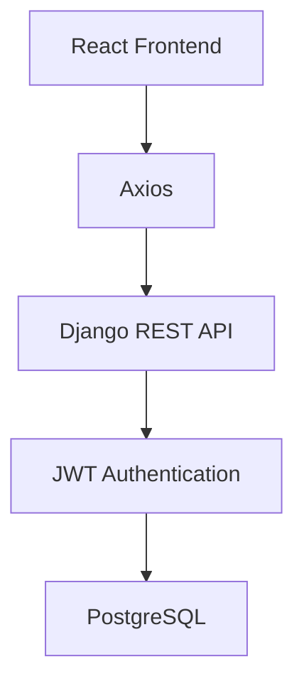
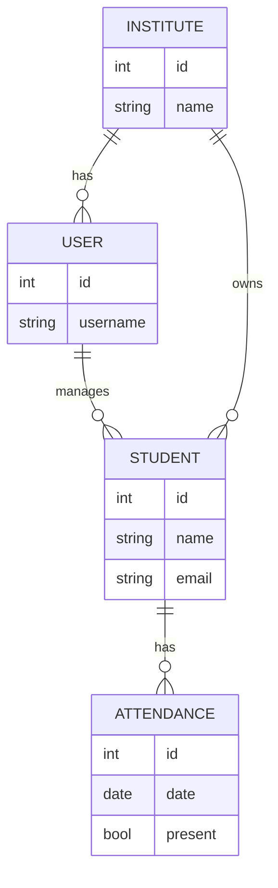

<p align="center">


</p>


## Login


---

## Dashboard


---

## Student Management








# InstiFlow – Multi-Tenant Coaching Management SaaS

InstiFlow is a **production-ready, multi-tenant Coaching Management SaaS** built to help coaching institutes digitize and automate their day-to-day operations. The platform provides secure authentication, student management, attendance tracking, and institute-specific data isolation, allowing multiple coaching centers to use the same application while keeping their data completely separate.


## 📌 Problem Statement

Many coaching institutes still rely on Excel sheets, paper records, and multiple disconnected tools to manage students, attendance, fees, and communication.

This leads to:

- ❌ Manual and repetitive administrative work
- ❌ Data inconsistency and duplication
- ❌ Poor record management
- ❌ Difficult scaling as institutes grow
- ❌ Lack of secure access control


## 💡 Solution

InstiFlow centralizes coaching institute operations into a single cloud-based platform.

Each institute gets its own isolated workspace while sharing the same application infrastructure through a **multi-tenant architecture**.

The platform automates administrative workflows and provides secure access for institute administrators.


# ✨ Features

## 🔐 Authentication

- Secure JWT Authentication
- HTTP-Only Cookie Authentication
- Refresh Token Rotation
- User Registration
- Login & Logout
- Protected APIs
- Role-Based Authorization


## 🔒 Password Recovery

- OTP-based Password Reset
- Email Verification
- Secure OTP Validation
- Password Update

## 👨‍🎓 Student Management

- Add Students
- Update Student Details
- Delete Students
- Search Students
- Institute-wise Student Isolation


## 📅 Attendance Management

- Mark Attendance
- View Attendance Records
- Student-wise Attendance History

---

## 🏢 Multi-Tenant Architecture

- Complete tenant data isolation
- Shared infrastructure
- Scalable SaaS architecture
- Secure access between institutes

---

## 📊 Dashboard

- Responsive UI
- Institute Overview
- Easy Navigation
- Modern User Experience

---

# 🛠 Tech Stack

## Frontend

- React.js
- Vite
- Tailwind CSS
- Axios
- React Router

---

## Backend

- Django
- Django REST Framework
- PostgreSQL
- JWT Authentication
- Custom User Model

---

## Authentication & Security

- JWT Access Tokens
- Refresh Tokens
- HTTP-Only Cookies
- CORS Configuration
- CSRF Protection
- Secure Password Hashing

---

## Email Service

- Brevo SMTP
- OTP Verification
- Password Reset Emails

---

## Deployment

### Frontend

- Vercel

### Backend

- Render

### Database

- PostgreSQL

---

# 🏗 Architecture

```
               React Frontend
                     │
                     │
                 Axios API
                     │
                     ▼
         Django REST Framework
                     │
      JWT Authentication (Cookies)
                     │
                     ▼
              PostgreSQL Database
                     │
        Multi-Tenant Data Isolation
```


# 📂 Project Structure

```
InstiFlow
│
├── frontend
│   ├── src
│   ├── components
│   ├── pages
│   ├── context
│   └── services
│
├── backend
│   ├── accounts
│   ├── students
│   ├── attendance
│   ├── config
│   └── requirements.txt
│
└── README.md
```

---

# 🔥 Key Highlights

- ✅ Production-ready architecture
- ✅ Secure Authentication
- ✅ Multi-Tenant SaaS
- ✅ RESTful API Design
- ✅ Responsive UI
- ✅ Scalable Backend
- ✅ Email OTP Verification
- ✅ Cookie-based Authentication
- ✅ Protected Routes
- ✅ Clean Project Structure

---

# 📈 Impact

InstiFlow solves real-world operational challenges faced by coaching institutes by:

- Reducing manual administrative work
- Centralizing student and attendance management
- Improving data security through tenant isolation
- Providing secure authentication and authorization
- Supporting multiple institutes on a single scalable platform

---

# 🚀 Future Improvements

- Fee Management Module
- Online Payment Integration
- Faculty Management
- Student Portal
- Parent Portal
- Notifications
- Analytics Dashboard
- Report Generation
- File Uploads
- Mobile Application

---

# ⚙️ Installation

## Clone Repository

```bash
git clone https://github.com/yourusername/instiflow.git

cd instiflow
```

---

## Backend Setup

```bash
cd backend

python -m venv .venv

source .venv/bin/activate
# Windows
.venv\Scripts\activate

pip install -r requirements.txt

python manage.py migrate

python manage.py runserver
```

---

## Frontend Setup

```bash
cd frontend

npm install

npm run dev
```

---

# 🔑 Environment Variables

## Backend

Create a `.env` file inside the backend directory.

```env
SECRET_KEY=

DEBUG=False

DATABASE_URL=

EMAIL_HOST=

EMAIL_PORT=

EMAIL_HOST_USER=

EMAIL_HOST_PASSWORD=

DEFAULT_FROM_EMAIL=

BREVO_API_KEY=

FRONTEND_URL=
```

---

## Frontend

```env
VITE_API_URL=
```

---

# 📸 Screenshots

> Add screenshots of:

- Login Page
- Dashboard
- Student Management
- Attendance Module
- Password Reset
- Responsive Mobile View

---

# 🤝 Contributing

Contributions are welcome!

1. Fork the repository
2. Create your feature branch
3. Commit your changes
4. Push to your branch
5. Open a Pull Request

---

# 👨‍💻 Author

**Ranjan Kumar**

Full Stack Developer

- Python
- Django
- Django REST Framework
- React
- PostgreSQL
- Tailwind CSS

---

# ⭐ Support

If you found this project helpful, consider giving it a ⭐ on GitHub.

It helps others discover the project and motivates further development.
